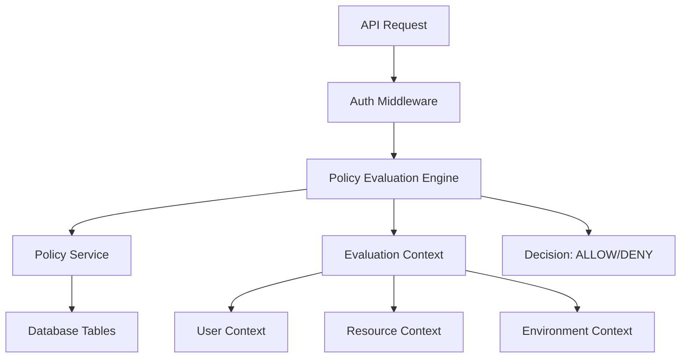

# 🛡️ Phantom API - Advanced Policies Management System

## Overview

The Phantom API Advanced Policies Management System replaces simple role-based access control with a comprehensive, flexible authorization framework. It supports multiple policy types, dynamic conditions, and fine-grained access control.

### Key Features

- **Multiple Policy Types**: Role-based, Attribute-based, and Custom policies
- **Dynamic Evaluation**: Real-time policy evaluation with contextual data
- **Conditional Logic**: Support for complex conditions and operators
- **Priority System**: Policy precedence and conflict resolution
- **Admin Interface**: Visual policy management and testing tools
- **Template System**: Pre-built policy templates for common scenarios

### Supported Access Patterns

| Pattern | Description | Use Case |
|---------|-------------|----------|
| **Role-Based (RBAC)** | Access based on user roles | Basic organizational permissions |
| **Attribute-Based (ABAC)** | Access based on user/resource attributes | Dynamic, context-aware permissions |
| **Custom Policies** | Complex business logic | Advanced scenarios requiring custom rules |

---

## Architecture

### Core Components



### Policy Evaluation Flow

1. **Request Authentication**: Verify JWT token and extract user information
2. **Context Building**: Gather user, resource, environment, and request data
3. **Policy Retrieval**: Load applicable policies for user/role
4. **Rule Evaluation**: Process rules in priority order
5. **Condition Checking**: Evaluate conditions against context
6. **Decision Making**: Return ALLOW/DENY with reasoning
7. **Audit Logging**: Record decision for compliance

### Database Schema Overview

```sql
-- Core policy definition
Policy: { id, name, description, type, rules, isActive, priority, createdBy, tags }

-- Individual policy rules
PolicyRule: { id, policyId, resource, action, effect, conditions, priority }

-- User-specific policy assignments
UserPolicy: { userId, policyId, assignedBy, expiresAt, context }

-- Role-based policy assignments
RolePolicy: { role, policyId, assignedBy, priority }
```

---

## Policy Types

### 1. Role-Based Policies (RBAC)

Simple role-based access control for organizational hierarchies.

```json
{
  "name": "Admin Full Access",
  "type": "ROLE_BASED",
  "rules": [
    {
      "resource": "*",
      "action": "*",
      "effect": "ALLOW",
      "priority": 100,
      "isActive": true
    }
  ],
  "isActive": true,
  "priority": 100
}
```

**Use Cases:**
- Basic admin/user/viewer roles
- Department-based access
- Simple hierarchical permissions

### 2. Attribute-Based Policies (ABAC)

Dynamic access control based on user and resource attributes.

```json
{
  "name": "Owner Edit Policy",
  "type": "ATTRIBUTE_BASED",
  "rules": [
    {
      "resource": "User",
      "action": "update",
      "effect": "ALLOW",
      "conditions": [
        {
          "field": "user.id",
          "operator": "eq",
          "value": "${resource.id}",
          "context": "user"
        }
      ],
      "priority": 100,
      "isActive": true
    }
  ]
}
```

**Use Cases:**
- Data ownership policies
- Multi-tenant applications
- Context-sensitive permissions

### 3. Custom Policies

Complex business logic with multiple conditions and advanced operators.

```json
{
  "name": "Business Hours Access",
  "type": "CUSTOM",
  "rules": [
    {
      "resource": "*",
      "action": "*",
      "effect": "ALLOW",
      "conditions": [
        {
          "field": "environment.timestamp",
          "operator": "gte",
          "value": "09:00",
          "context": "environment"
        },
        {
          "field": "environment.timestamp",
          "operator": "lte",
          "value": "17:00",
          "context": "environment"
        },
        {
          "field": "user.department",
          "operator": "in",
          "value": ["sales", "support"],
          "context": "user"
        }
      ],
      "priority": 100,
      "isActive": true
    }
  ]
}
```

**Use Cases:**
- Time-based restrictions
- Geographic limitations
- Complex business rules

---

## Database Schema

### Tables Structure

#### Policy Table
```sql
CREATE TABLE Policy (
  id TEXT PRIMARY KEY,
  name TEXT UNIQUE NOT NULL,
  description TEXT,
  type TEXT CHECK(type IN ('ROLE_BASED', 'ATTRIBUTE_BASED', 'CUSTOM')) NOT NULL,
  rules TEXT NOT NULL,  -- JSON array
  isActive BOOLEAN DEFAULT TRUE,
  priority INTEGER DEFAULT 100,
  createdBy TEXT NOT NULL,
  tags TEXT DEFAULT '[]',  -- JSON array
  createdAt DATETIME DEFAULT CURRENT_TIMESTAMP,
  updatedAt DATETIME DEFAULT CURRENT_TIMESTAMP
);
```

#### PolicyRule Table
```sql
CREATE TABLE PolicyRule (
  id TEXT PRIMARY KEY,
  policyId TEXT NOT NULL REFERENCES Policy(id) ON DELETE CASCADE,
  resource TEXT NOT NULL,
  action TEXT CHECK(action IN ('create', 'read', 'update', 'delete', 'list', 'export', 'import', '*')) NOT NULL,
  effect TEXT CHECK(effect IN ('ALLOW', 'DENY')) DEFAULT 'ALLOW',
  conditions TEXT DEFAULT '[]',  -- JSON array
  priority INTEGER DEFAULT 100,
  description TEXT,
  isActive BOOLEAN DEFAULT TRUE,
  createdAt DATETIME DEFAULT CURRENT_TIMESTAMP
);
```

#### UserPolicy Table
```sql
CREATE TABLE UserPolicy (
  id TEXT PRIMARY KEY,
  userId TEXT NOT NULL,
  policyId TEXT NOT NULL REFERENCES Policy(id) ON DELETE CASCADE,
  assignedBy TEXT NOT NULL,
  assignedAt DATETIME DEFAULT CURRENT_TIMESTAMP,
  expiresAt DATETIME,
  isActive BOOLEAN DEFAULT TRUE,
  context TEXT DEFAULT '{}',  -- JSON object
  UNIQUE(userId, policyId)
);
```

#### RolePolicy Table
```sql
CREATE TABLE RolePolicy (
  id TEXT PRIMARY KEY,
  role TEXT CHECK(role IN ('anon', 'user', 'admin', 'moderator', 'viewer', 'editor')) NOT NULL,
  policyId TEXT NOT NULL REFERENCES Policy(id) ON DELETE CASCADE,
  assignedBy TEXT NOT NULL,
  assignedAt DATETIME DEFAULT CURRENT_TIMESTAMP,
  isActive BOOLEAN DEFAULT TRUE,
  priority INTEGER DEFAULT 100,
  UNIQUE(role, policyId)
);
```

### Indexes for Performance

```sql
-- Policy table indexes
CREATE INDEX idx_policy_type_active ON Policy(type, isActive);
CREATE INDEX idx_policy_priority ON Policy(priority);
CREATE INDEX idx_policy_name ON Policy(name);

-- PolicyRule table indexes
CREATE INDEX idx_rule_policy_resource_action ON PolicyRule(policyId, resource, action);
CREATE INDEX idx_rule_resource_action_active ON PolicyRule(resource, action, isActive);
CREATE INDEX idx_rule_priority_effect ON PolicyRule(priority, effect);

-- UserPolicy table indexes
CREATE INDEX idx_user_policy_user_active ON UserPolicy(userId, isActive);
CREATE INDEX idx_user_policy_expires ON UserPolicy(expiresAt);

-- RolePolicy table indexes
CREATE INDEX idx_role_policy_role_active ON RolePolicy(role, isActive);
CREATE INDEX idx_role_policy_priority ON RolePolicy(priority);
```

---

## API Reference

### Policy Management Endpoints

#### Get All Policies
```http
GET /admin/api/policies?isActive=true&type=ROLE_BASED
Authorization: Bearer <admin_token>

Response:
{
  "success": true,
  "data": [
    {
      "id": "policy_123",
      "name": "Admin Access",
      "type": "ROLE_BASED",
      "rules": [...],
      "isActive": true,
      "priority": 100
    }
  ],
  "count": 1
}
```

#### Create Policy
```http
POST /admin/api/policies
Authorization: Bearer <admin_token>
Content-Type: application/json

{
  "name": "Editor Policy",
  "description": "Content editing permissions",
  "type": "ROLE_BASED",
  "rules": [
    {
      "resource": "Article",
      "action": "update",
      "effect": "ALLOW",
      "priority": 100,
      "isActive": true
    }
  ],
  "isActive": true,
  "priority": 100,
  "tags": ["content", "editing"]
}

Response:
{
  "success": true,
  "data": { /* created policy */ },
  "message": "Policy created successfully"
}
```

#### Update Policy
```http
PUT /admin/api/policies/:id
Authorization: Bearer <admin_token>
Content-Type: application/json

{
  "name": "Updated Policy Name",
  "isActive": false
}
```

#### Delete Policy
```http
DELETE /admin/api/policies/:id
Authorization: Bearer <admin_token>

Response:
{
  "success": true,
  "message": "Policy deleted successfully"
}
```

### Policy Assignment Endpoints

#### Assign Policy to User
```http
POST /admin/api/policies/:policyId/assign/user/:userId
Authorization: Bearer <admin_token>
Content-Type: application/json

{
  "expiresAt": "2025-12-31T23:59:59Z"
}
```

#### Assign Policy to Role
```http
POST /admin/api/policies/:policyId/assign/role/:role
Authorization: Bearer <admin_token>
Content-Type: application/json

{
  "priority": 150
}
```

#### Get User Policies
```http
GET /admin/api/users/:userId/policies?role=user
Authorization: Bearer <admin_token>

Response:
{
  "success": true,
  "data": [/* user's policies */],
  "count": 3
}
```

### Policy Testing Endpoints

#### Test Access
```http
POST /admin/api/policies/test-access
Authorization: Bearer <admin_token>
Content-Type: application/json

{
  "user": {
    "id": "user_123",
    "role": "user",
    "email": "user@example.com"
  },
  "resource": {
    "name": "Article",
    "id": "article_456"
  },
  "action": "update",
  "environment": {
    "timestamp": "2025-07-04T14:30:00Z",
    "ip": "192.168.1.1"
  }
}

Response:
{
  "success": true,
  "data": {
    "allowed": true,
    "reason": "Policy 'Editor Access' rule matched: Article:update",
    "matchedPolicy": {
      "id": "policy_123",
      "name": "Editor Access"
    }
  }
}
```

#### Test Specific Policy
```http
POST /admin/api/policies/:id/test
Authorization: Bearer <admin_token>
Content-Type: application/json

{
  "user": { /* user context */ },
  "resource": { /* resource context */ },
  "action": "read"
}

Response:
{
  "success": true,
  "data": {
    "allowed": true,
    "reason": "Rule matched",
    "evaluation": {
      "matched": true,
      "effect": "ALLOW",
      "policy": {
        "id": "policy_123",
        "name": "Test Policy",
        "type": "ROLE_BASED"
      }
    }
  }
}
```

### Analytics Endpoints

#### Get Policy Analytics
```http
GET /admin/api/policies-analytics?timeframe=7d
Authorization: Bearer <admin_token>

Response:
{
  "success": true,
  "data": {
    "totalPolicies": 15,
    "activePolicies": 12,
    "policyTypes": {
      "ROLE_BASED": 8,
      "ATTRIBUTE_BASED": 4,
      "CUSTOM": 3
    },
    "accessGrants": 1250,
    "accessDenials": 45,
    "recentActivity": [...],
    "topResources": [...]
  }
}
```

#### Get Policy Templates
```http
GET /admin/api/policies-templates
Authorization: Bearer <admin_token>

Response:
{
  "success": true,
  "data": [
    {
      "id": "role-based-basic",
      "name": "Basic Role-Based Policy",
      "description": "Simple role-based access control",
      "type": "ROLE_BASED",
      "template": { /* policy template */ }
    }
  ]
}
```

---

## Admin Interface

### Policies Dashboard

The admin interface provides a comprehensive dashboard for managing policies:

#### Main Features

1. **Policy List View**
   - Search and filter policies
   - Quick enable/disable toggle
   - Policy type and status indicators
   - Rules summary display

2. **Policy Creation Wizard**
   - Step-by-step policy creation
   - Template selection
   - Rule builder with visual interface
   - Condition editor with autocomplete

3. **Policy Testing Interface**
   - Interactive policy testing
   - Context builder for evaluation
   - Real-time results display
   - Policy simulation tools

4. **Analytics Dashboard**
   - Policy usage statistics
   - Access grant/denial metrics
   - Policy type distribution
   - Performance analytics

#### Navigation Structure

```
Admin Panel
├── Dashboard
├── Data Management
│   ├── Tables
│   └── Users
├── Security & Access
│   ├── 🆕 Policies ← New Section
│   ├── API Tokens
│   └── Logs
└── Tools
```

#### Policy Management Workflow

1. **Create Policy**
   ```
   Policies → Create Policy → Select Template → Configure Rules → Test → Deploy
   ```

2. **Assign Policies**
   ```
   Policies → Select Policy → Assign → Choose User/Role → Set Expiration → Confirm
   ```

3. **Test Access**
   ```
   Policies → Test Access → Set Context → Run Evaluation → View Results
   ```

4. **Monitor Usage**
   ```
   Policies → Analytics → View Metrics → Export Reports
   ```

---

## Implementation Examples

### Basic Role-Based Setup

```typescript
// 1. Create basic role policies
const adminPolicy = await policyService.createPolicy({
  name: "Admin Full Access",
  type: "ROLE_BASED",
  rules: [
    {
      resource: "*",
      action: "*",
      effect: "ALLOW",
      priority: 100,
      isActive: true
    }
  ],
  isActive: true,
  priority: 100,
  createdBy: "system"
});

// 2. Assign to admin role
await policyService.assignPolicyToRole("admin", adminPolicy.id!, "system");

// 3. Use in middleware
app.use('/admin/*', policyAuth('*', '*'));
```

### Attribute-Based User Ownership

```typescript
// 1. Create ownership policy
const ownershipPolicy = await policyService.createPolicy({
  name: "User Data Ownership",
  type: "ATTRIBUTE_BASED",
  rules: [
    {
      resource: "User",
      action: "update",
      effect: "ALLOW",
      conditions: [
        {
          field: "user.id",
          operator: "eq",
          value: "${resource.id}",
          context: "user"
        }
      ],
      priority: 200,
      isActive: true
    }
  ],
  isActive: true,
  priority: 200,
  createdBy: "system"
});

// 2. Assign to user role
await policyService.assignPolicyToRole("user", ownershipPolicy.id!, "system");
```

### Time-Based Access Control

```typescript
// Business hours policy
const businessHoursPolicy = await policyService.createPolicy({
  name: "Business Hours Only",
  type: "CUSTOM",
  rules: [
    {
      resource: "sensitive_data",
      action: "*",
      effect: "DENY",
      conditions: [
        {
          field: "environment.hour",
          operator: "lt",
          value: 9,
          context: "environment"
        }
      ],
      priority: 300,
      isActive: true
    },
    {
      resource: "sensitive_data",
      action: "*",
      effect: "DENY",
      conditions: [
        {
          field: "environment.hour",
          operator: "gt",
          value: 17,
          context: "environment"
        }
      ],
      priority: 300,
      isActive: true
    }
  ],
  isActive: true,
  priority: 300,
  createdBy: "system"
});
```

### Dynamic Resource Filtering

```typescript
// Use policy filtering in controllers
app.get('/api/users', async (req, res) => {
  // Get all users
  const allUsers = await tableManager.findAll('User');
  
  // Filter based on user policies
  const filteredUsers = await policyFilter(req, allUsers, 'User');
  
  res.json({ data: filteredUsers });
});
```

---

## Migration Guide

### From Simple Role-Based to Advanced Policies

#### Step 1: Backup Current Configuration

```bash
# Export current metadata
cp -r backend/meta backend/meta.backup

# Backup database
cp backend/data/phantom.db backend/data/phantom.db.backup
```

#### Step 2: Run Database Migration

```typescript
// Migration script (automatic with new tables)
// PolicyService will create tables automatically when first used
```

#### Step 3: Migrate Existing Permissions

```typescript
// Convert old metadata permissions to policies
const migrationScript = async () => {
  const metaFiles = await fs.readdir('backend/meta');
  
  for (const file of metaFiles) {
    if (!file.endsWith('.json')) continue;
    
    const meta = JSON.parse(await fs.readFile(`backend/meta/${file}`, 'utf8'));
    const resourceName = path.basename(file, '.json');
    
    if (meta.permissions) {
      // Create policies for each permission
      for (const [action, roles] of Object.entries(meta.permissions)) {
        const policy = await policyService.createPolicy({
          name: `${resourceName} ${action} Policy`,
          type: "ROLE_BASED",
          rules: [
            {
              resource: resourceName,
              action: action,
              effect: "ALLOW",
              priority: 100,
              isActive: true
            }
          ],
          isActive: true,
          priority: 100,
          createdBy: "migration"
        });
        
        // Assign to roles
        for (const role of roles) {
          await policyService.assignPolicyToRole(role, policy.id!, "migration");
        }
      }
    }
  }
};
```

#### Step 4: Update Middleware Usage

```typescript
// Old approach
app.use('/api/:resource/:action', requireRole(['admin', 'user']));

// New approach
app.use('/api/:resource/:action', dynamicPolicyAuth(':action'));
```

#### Step 5: Test Migration

```typescript
// Test access with new system
const testContext = {
  user: { id: 'user_123', role: 'user' },
  resource: { name: 'User', id: 'user_123' },
  action: 'read'
};

const result = await policyService.evaluateAccess(testContext);
console.log('Access allowed:', result.allowed);
```

---

## Best Practices

### Policy Design

1. **Use Descriptive Names**
   ```typescript
   // Good
   name: "Article Authors Can Edit Own Content"
   
   // Bad
   name: "Policy 1"
   ```

2. **Set Appropriate Priorities**
   ```typescript
   // Security policies (high priority)
   priority: 900
   
   // Business logic (medium priority)
   priority: 500
   
   // Default permissions (low priority)
   priority: 100
   ```

3. **Use Specific Resources When Possible**
   ```typescript
   // Good
   resource: "Article"
   
   // Use sparingly
   resource: "*"
   ```

### Performance Optimization

1. **Index Critical Fields**
   ```sql
   CREATE INDEX idx_user_role_active ON UserPolicy(userId, isActive);
   ```

2. **Cache Policy Evaluations**
   ```typescript
   // Implement caching in production
   const cacheKey = `policy:${userId}:${resource}:${action}`;
   const cached = await cache.get(cacheKey);
   if (cached) return cached;
   ```

3. **Limit Policy Complexity**
   ```typescript
   // Avoid too many conditions per rule
   conditions: [...] // Keep under 5 conditions per rule
   ```

### Security Considerations

1. **Always Use DENY for Security Policies**
   ```typescript
   {
     resource: "sensitive_data",
     action: "*",
     effect: "DENY", // Explicit deny
     conditions: [...]
   }
   ```

2. **Validate Input Data**
   ```typescript
   // Always validate policy data before creation
   const validation = await policyApiService.validatePolicy(policyData);
   if (!validation.valid) {
     throw new Error(validation.errors.join(', '));
   }
   ```

3. **Audit Policy Changes**
   ```typescript
   // Log all policy modifications
   logger.info({
     action: 'policy_created',
     policyId: policy.id,
     createdBy: req.user.id,
     timestamp: new Date()
   });
   ```

### Testing Strategies

1. **Unit Test Policy Logic**
   ```typescript
   describe('Policy Evaluation', () => {
     it('should allow owner to edit own data', async () => {
       const context = {
         user: { id: 'user_123', role: 'user' },
         resource: { name: 'User', id: 'user_123' },
         action: 'update'
       };
       
       const result = await policyService.evaluateAccess(context);
       expect(result.allowed).toBe(true);
     });
   });
   ```

2. **Integration Testing**
   ```typescript
   // Test end-to-end policy enforcement
   const response = await request(app)
     .put('/api/User/user_123')
     .set('Authorization', `Bearer ${userToken}`)
     .send({ name: 'Updated Name' });
     
   expect(response.status).toBe(200);
   ```

3. **Performance Testing**
   ```typescript
   // Test policy evaluation performance
   console.time('Policy Evaluation');
   await policyService.evaluateAccess(context);
   console.timeEnd('Policy Evaluation'); // Should be < 50ms
   ```

---

## Troubleshooting

### Common Issues

#### Issue: "No policies found for user"
```
Symptoms: All requests denied with "No policies found"
Cause: User has no policies assigned to their role or user ID
Solution: Assign at least one policy to the user's role
```

```typescript
// Check user policies
const policies = await policyService.getUserPolicies(userId, userRole);
console.log('User policies:', policies.length);

// Assign default policy if needed
await policyService.assignPolicyToRole(userRole, defaultPolicyId, 'system');
```

#### Issue: "Policy evaluation timeout"
```
Symptoms: Slow response times or timeouts
Cause: Complex policies with many conditions
Solution: Optimize policies and add database indexes
```

```typescript
// Add indexes for performance
CREATE INDEX idx_policy_evaluation ON UserPolicy(userId, isActive);
CREATE INDEX idx_rule_lookup ON PolicyRule(resource, action, isActive);

// Simplify complex policies
// Instead of one policy with 20 conditions, create multiple simpler policies
```

#### Issue: "Conflicting policy results"
```
Symptoms: Inconsistent access decisions
Cause: Multiple policies with different effects
Solution: Use priority system and explicit DENY policies
```

```typescript
// High priority DENY policy
{
  priority: 900,
  effect: "DENY",
  // ... conditions
}

// Lower priority ALLOW policy
{
  priority: 100,
  effect: "ALLOW",
  // ... conditions
}
```

### Debug Tools

#### Enable Debug Logging
```typescript
// In policyService.ts
logger.debug({
  userId: context.user.id,
  resource: context.resource.name,
  action: context.action,
  policies: policies.map(p => p.name),
  evaluation: result
}, 'Policy evaluation debug');
```

#### Test Policy in Isolation
```typescript
// Test specific policy
const testResult = await policyService.testPolicy(policyId, context);
console.log('Policy test result:', testResult);
```

#### Validate Policy Configuration
```typescript
// Check policy syntax
const validation = await policyApiService.validatePolicy(policy);
if (!validation.valid) {
  console.error('Policy validation errors:', validation.errors);
}
```

### Performance Monitoring

```typescript
// Add performance metrics
const startTime = Date.now();
const result = await policyService.evaluateAccess(context);
const duration = Date.now() - startTime;

logger.info({
  duration,
  userId: context.user.id,
  resource: context.resource.name,
  action: context.action,
  allowed: result.allowed
}, 'Policy evaluation performance');
```

---

## Support and Maintenance

### Monitoring Policy Performance

1. **Database Query Performance**
   ```sql
   EXPLAIN QUERY PLAN SELECT * FROM Policy WHERE isActive = 1;
   ```

2. **Policy Evaluation Metrics**
   ```typescript
   // Track evaluation times
   const metrics = {
     averageEvaluationTime: 45, // ms
     evaluationsPerMinute: 150,
     cacheHitRate: 0.85
   };
   ```

3. **Access Pattern Analysis**
   ```typescript
   // Most accessed resources
   const topResources = [
     { resource: 'User', requests: 1250 },
     { resource: 'Article', requests: 890 },
     { resource: 'Comment', requests: 445 }
   ];
   ```

### Regular Maintenance Tasks

1. **Cleanup Expired Policies**
   ```sql
   DELETE FROM UserPolicy WHERE expiresAt < CURRENT_TIMESTAMP;
   ```

2. **Archive Inactive Policies**
   ```sql
   UPDATE Policy SET isActive = 0 WHERE updatedAt < date('now', '-90 days');
   ```

3. **Optimize Database**
   ```sql
   ANALYZE; -- Update SQLite statistics
   VACUUM; -- Defragment database
   ```

---

**🎉 Congratulations!** You now have a comprehensive advanced policies management system integrated into Phantom API. The system provides enterprise-grade authorization capabilities while maintaining the simplicity and flexibility that makes Phantom API unique.

For additional support or advanced configurations, please refer to the main Phantom API documentation or contact the development team.